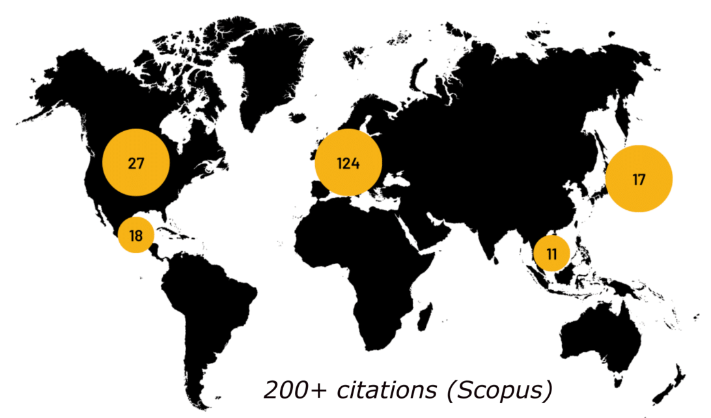
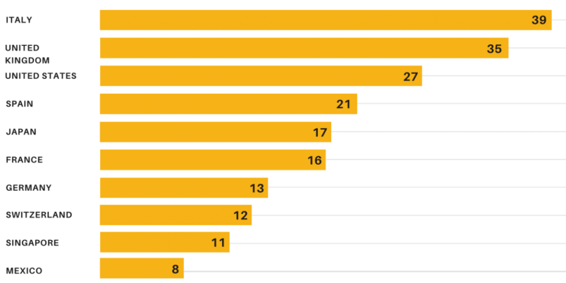
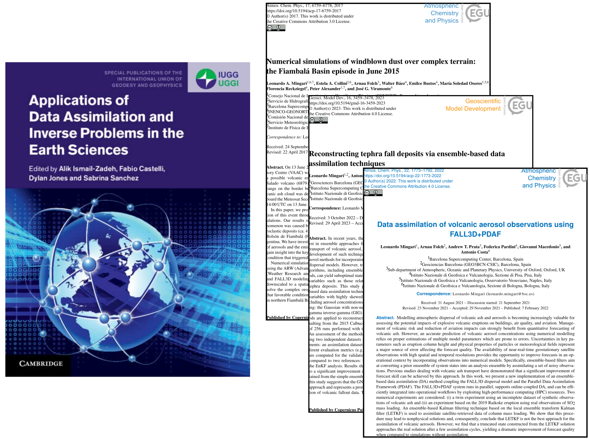
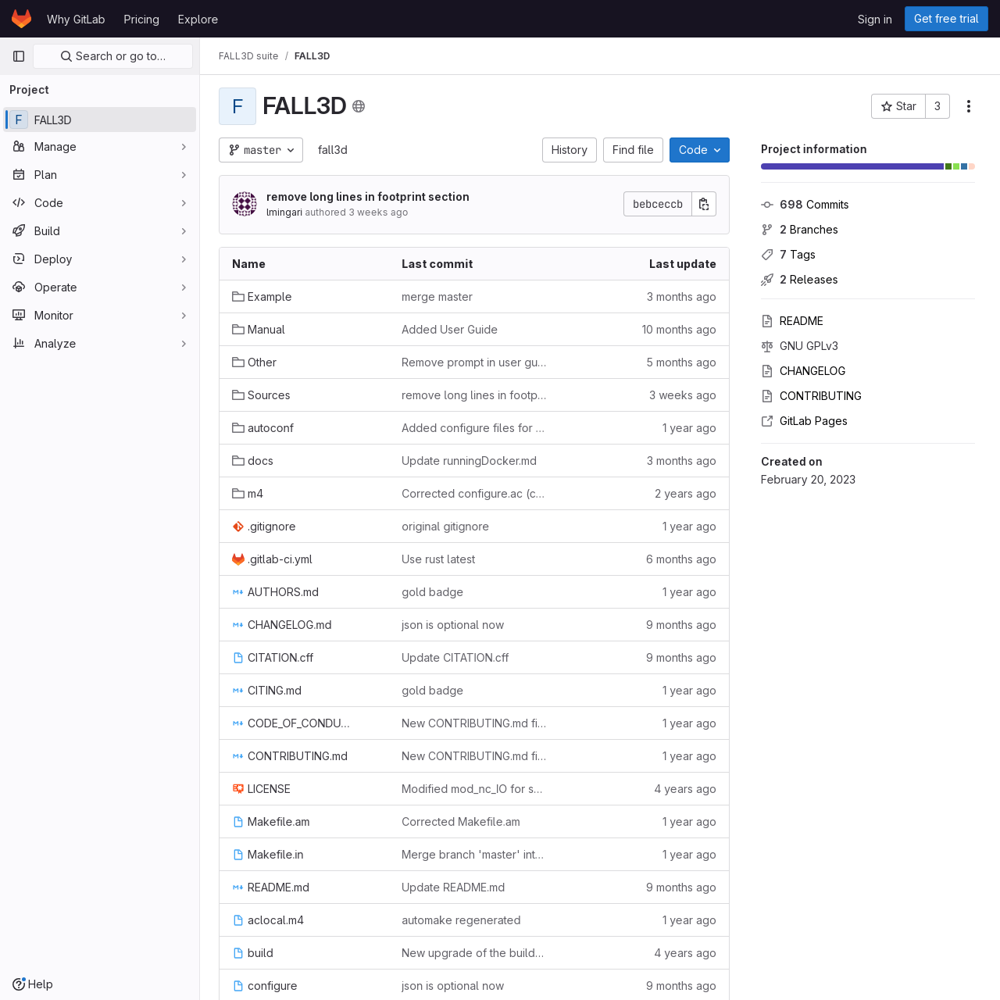
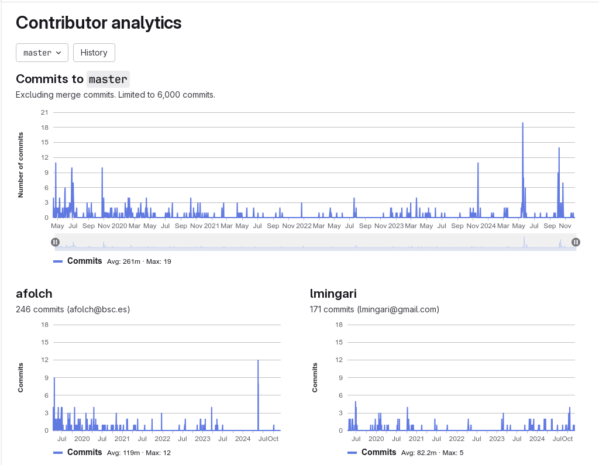
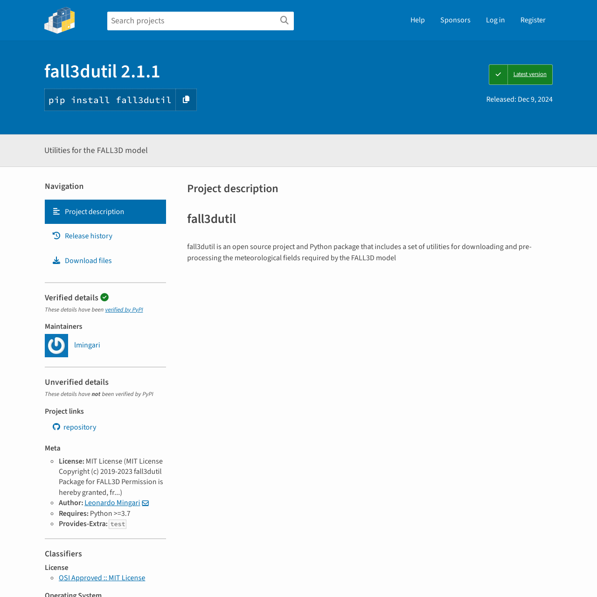
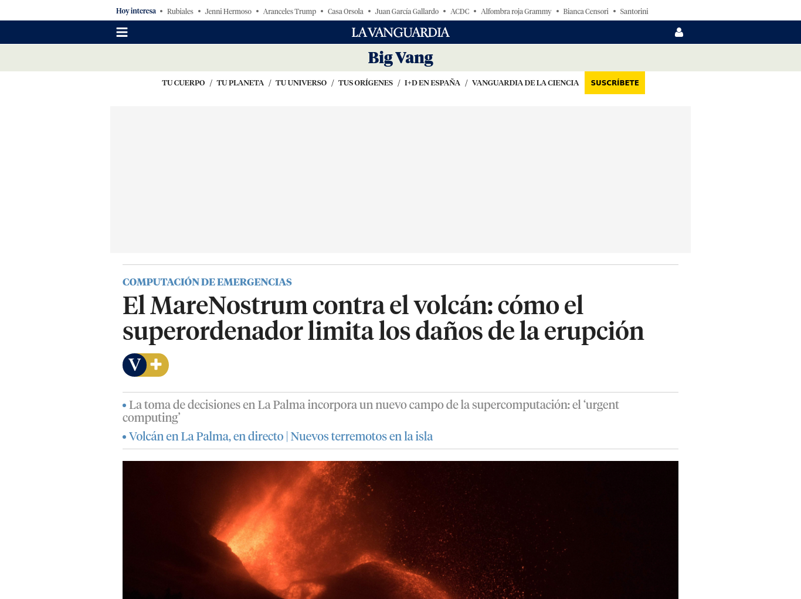
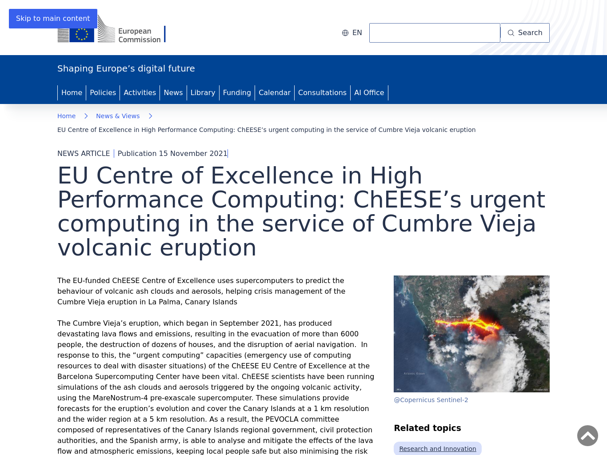
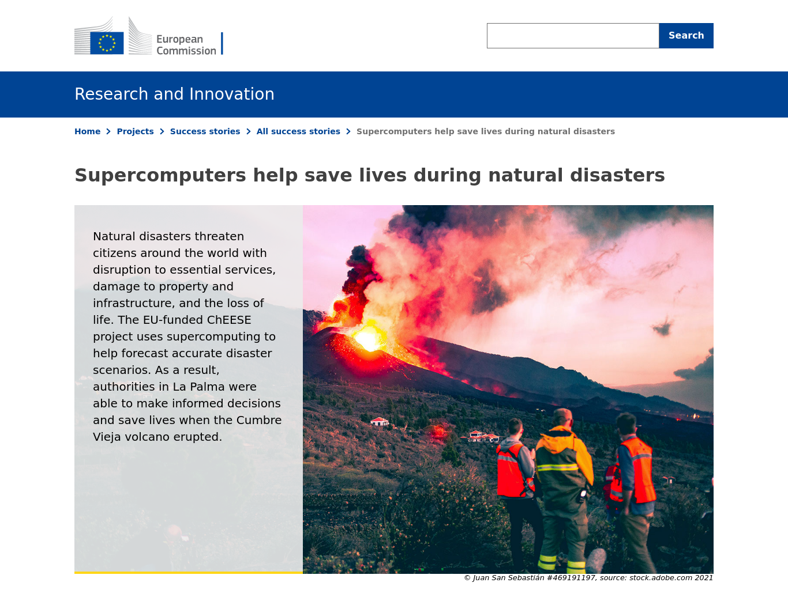
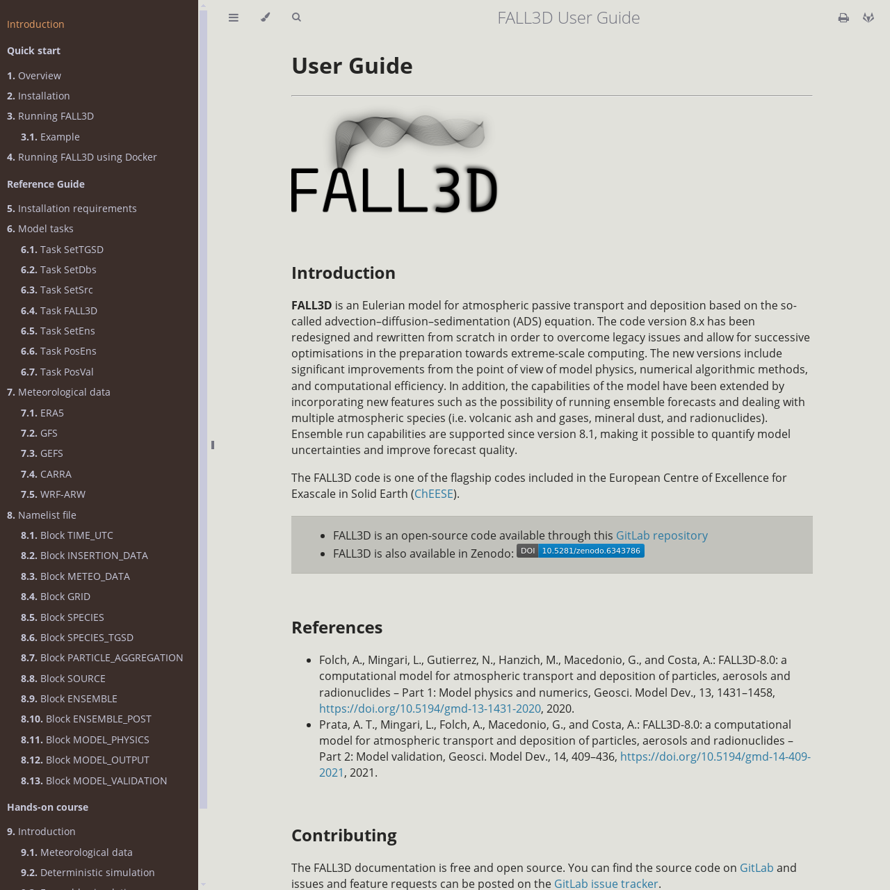

# Introducción

## Introduction: about me

\small
:::::::::: {.columns}
:::: {.column}

- Postdoctoral researcher
- Institute: Geosciences Barcelona (GEO3BCN-CSIC) 
- Start date: January 2023
- Job position: Doctor FC2
- Contact: [lmingari@geo3bcn.csic.es](mailto:lmingari@geo3bcn.csic.es)

\vspace{1em}

:::
::: {.column}

Online presence:

- CSIC: [Institutional website](https://rb.gy/5tccz1)
- Scopus: [56015606000](https://www.scopus.com/authid/detail.uri?authorId=56015606000)
- ResearchGate: [Leonardo-Mingari](https://www.researchgate.net/profile/Leonardo-Mingari)
- ORCID: [0000-0002-6584-4699](https://orcid.org/0000-0002-6584-4699)
- GitHub: [lmingari](https://ww.github.com/lmingari)
- GitLab: [lmingari](https://ww.gitlab.com/lmingari)
:::
::::::::::

## Introduction: curriculum summary
- Research with background in physics, atmospheric sciences, numerical modelling and strong programming skills
- Great potential to develop cutting-edge research in volcanology
- Participation in 10 international projects
- International collaboration: 93.8% (Scopus)
- Active participation in workshops, seminars and conferences
- 18 peer-reviewed articles and chapter books
- Most important peer-reviewed journals of his field
- h-index: 10 (Scopus), 11 (RG), 12 (Scholar)
- Contribution in peer-reviewing papers
- Involved in the thesis supervision of undergraduate, master and PhD students

## Introduction: research lines
:::::::::: {.columns}
:::: {.column width="40%"}

:::
::: {.column width="50%"}
\footnotesize
Specific areas:
\vspace{1em}

1. Computational volcanology
1. Mesoscale & Microscale meteorology
1. Atmospheric dispersion modelling
1. Numerical weather prediction modelling
1. Ensemble-based data assimilation techniques
1. High Performance Computing (HPC) applications
1. Computational fluid dynamics
:::
::::::::::

## Introduction: technological transfer
\footnotesize
- One of the main developers of FALL3D
- A model for atmospheric transport of aerosols primarily focused on volcanological applications 
- Track record of 200+ publications
- Ever-growing community of users worldwide
- Regular support to operational forecasting centers, such as Volcanic Ash Advisory Centres (VAAC)
- We prioritise research that addresses societal
challenges and allows the transfer of technology and innovation to society

:::::::::: {.columns}
:::: {.column}

:::
::: {.column}

:::
::::::::::

## Introduction: education and research career
**Education**

- \textcolor{red}{2018: PhD in Physical Sciences}
  - Department of Physics, University of Buenos Aires, Argentina
  - Sub-area: Earth & Environmental Sciences
  - Distinction: Outstanding thesis
- \textcolor{red}{2012: University Degree in Physics}
  - Department of Physics, University of Buenos Aires, Argentina
  - Average university grade: 9.04/10.0

## Introduction: education and research career

\only<1>{
    \includegraphics[width=\textwidth]{figures/career0.pdf}
}
\only<2>{
    \includegraphics[width=\textwidth]{figures/career1.pdf}
}
\only<3>{
    \includegraphics[width=\textwidth]{figures/career2.pdf}
}
\only<4>{
    \includegraphics[width=\textwidth]{figures/career3.pdf}
}
\only<5>{
    \includegraphics[width=\textwidth]{figures/career4.pdf}
}
\only<6>{
    \includegraphics[width=\textwidth]{figures/career5.pdf}
}
\only<7>{
    \includegraphics[width=\textwidth]{figures/career6.pdf}
}
\only<8>{
    \includegraphics[width=\textwidth]{figures/career7.pdf}
}
\only<9>{
    \includegraphics[width=\textwidth]{figures/career8.pdf}
}
\only<10>{
    \includegraphics[width=\textwidth]{figures/career9.pdf}
}
\only<11>{
    \includegraphics[width=\textwidth]{figures/career10.pdf}
}
\only<12>{
    \includegraphics[width=\textwidth]{figures/career11.pdf}
}

# Aportaciones científico-técnicas

## Peer-reviewed publications

\tiny
|Type       |Journal                      |Year|Author|1st Quartile|1st Decile|Citations|
|-----------|-----------------------------|----|------|------------|----------|---------|
|Article    |Commun. Earth Environ.       |2024|2nd   |Yes         |Yes (10)  |3        |
|Article    |Geosci. Model Dev.           |2023|1st   |Yes         |Yes (9)   |3        |
|Article    |Future Gener. Comput. Syst.  |2023|-     |Yes         |Yes (31)  |17       |
|Article    |Atmos. Chem. Phys.           |2022|1st   |Yes         |Yes (6)   |19       |
|Article    |Nat. Hazards Earth Syst. Sci.|2022|-     |Yes         |No        |16       |
|Article    |Front. Earth Sci.            |2022|2nd   |Yes         |No        |17       |
|Article    |Atmos. Res.                  |2021|-     |Yes         |No        |11       |
|Article    |Geosci. Model Dev.           |2021|2nd   |Yes         |Yes (5)   |35       |
|Article    |Atmosphere                   |2020|1st   |No (Q2)     |No        |12       |
|Article    |Sci. Rep.                    |2020|3rd   |Yes         |Yes (10)  |8        |
|Article    |Geosci. Model Dev.           |2020|2nd   |Yes         |Yes (3)   |56       |
|Article    |Front. Earth Sci.            |2020|-     |Yes         |No        |43       |
|Conf. paper|Proc. SPIE                   |2018|-     |No          |No        |0        |
|Article    |Atmos. Chem. Phys.           |2017|1st   |Yes         |Yes (4)   |25       |
|Article    |Remote Sens. Lett.           |2017|2nd   |Yes         |No        |7        |
|Article    |J. Volcanol. Geotherm. Res.  |2016|3rd   |Yes         |No        |68       |
|Article    |Nat. Hazards Earth Syst. Sci.|2014|2nd   |Yes         |No        |58       |
|Book ch.   |N/A                          |2023|2nd   |N/A         |N/A       |1        |

## Publication summary

:::::: {.columns}
:::: {.column}
- 17 peer-reviewed articles
- 1 book chapter
- articles in top-10: 7
- 1st author: 4
- 1st author in Q1 (D1): 3
- 1st author in top-10: 3
::::

:::: {.column}

::::
::::::

## Publication summary

:::::::::: {.columns align=top}
:::: {.column width="30%"}

\tiny
|Author order|Publications (%)|
|------------|------------|
|1st         | 4  (22.2%) |
|1st+2nd     | 11 (61.1%) |
|1st+2nd+3rd | 13 (72.2%) |
|other       | 5  (27.8%) |

|Journal|Publications (%)|
|-------|------------|
|Q1     | 15 (88.2%) |
|D1     | 9  (52.9%) |
|Top-10 | 7  (41.2%) |

^* Based on SJR

:::
::: {.column width="70%"}

\only<1>{
    \includegraphics[width=\textwidth]{figures/pie_chart_level1.pdf}
}

\only<2>{
    \includegraphics[width=\textwidth]{figures/pie_chart_level2.pdf}
}

\only<3>{
    \includegraphics[width=\textwidth]{figures/pie_chart_level3.pdf}
}

\only<4>{
    \centering
    \vspace{3em}
    \includegraphics[width=\textwidth]{figures/percentiles.pdf}
}

:::
::::::::::

## Publication summary

\small
|         | Scholar | ResearchGate|Scopus|
|---------|---------|-------------|------|
|Citations|415 | 409|292 | 
|h-index  |12  | 11 |10  |
|i10-index|12  |    |    |
|Field-Weighted CI| | |1.24|

\begin{center}

\includegraphics[width=0.7\textwidth]{figures/citations.pdf}

\end{center}

## Scientific/technological transfer: FALL3D

:::::::::: {.columns align=top}
:::: {.column width="50%"}

\small
- One of the main developers of the FALL3D model
- The code is free and open source
- Track record of 200+ publications
- FALL3D: flagship codes in the European Centre of Excellence for Exascale in Solid Earth (ChEESE) 
- Deployed in the most powerful European supercomputers

:::
::: {.column width="50%"}

{ width=50% }

\vspace{1em}

:::
::::::::::

## Scientific/technological transfer: FALL3D

\footnotesize
Remarkable collaborations:

:::::::::: {.columns align=top}
:::: {.column}

- Icelandic Meteorological Office
- Buenos Aires Volcanic Ash Advisory Centre (VAAC)
:::
::: {.column}

- Universidad Nacional Autónoma de México (UNAM)
- NVIDIA corp.
:::
::::::::::

## Scientific/technological transfer: FALL3D
:::::::::: {.columns}
:::: {.column}

\footnotesize

|             | Contributions | Total|
|-------------|---------------|------|
|Commits      | 208   | 752   |
|Lines of code| 24406 | 73488 |

:::
::: {.column}

:::
::::::::::

## Scientific/technological transfer: FALL3D

:::::::::: {.columns}
:::: {.column}

- **fall3dutil** Python package 
- Pre-processing tool required to configure FALL3D
- Open source
- Single contributor
- 1832 lines of code
- Extensively used by FALL3D users

:::
::: {.column}

:::
::::::::::

# Otros méritos curriculares

## Otros méritos curriculares: Supervising experience

\footnotesize 
**PhD Thesis (ongoing) - 2020/Present:**

\vspace{-1em}
- Student: Eliana Vázquez
- Supervisors: __Leonardo Mingari__ & Soledad Osores
- Institute: University of Buenos Aires, Buenos Aires, Argentina
\vspace{-1ex}

**University degree thesis (Licenciatura) - 2024/2025:**

\vspace{-1em}
- Student: Micaela Clara Maurizi
- Supervisors: Soledad Osores & __Leonardo Mingari__
- Institute: University of Buenos Aires, Buenos Aires, Argentina
\vspace{-1ex}

**Master TFM - 2024:**

\vspace{-1em}
- Student: Samanta Córdova Sánchez
- Supervisors: Dario Pedrazzi & __Leonardo Mingari__
- Institute: Universitat Autònoma de Barcelona, Barcelona, Spain
\vspace{-1ex}

**Master TFM - 2024:**

\vspace{-1em}
- Student: Joan Aymerich Nicolàs
- Supervisors: __Leonardo Mingari__ & Arnau Folch
- Institute: Universitat Autònoma de Barcelona, Barcelona, Spain

## Otros méritos curriculares: Community involvement

**Peer review activity**

* Review for journal: Atmosphere (2021)
* Review for journal: Atmospheric Chemistry and Physics (2021): Q1 journal (top-10)

**Participation in scientific meetings**

* co-convener in session: "Technologies for Forecasting Volcanic Hazards: Enhancing Risk Mitigation through Observations and Models", EGU General Assembly 2025

* co-convener in session: "Forecasting volcanic hazards: new technologies and probabilistic multi-source and multi-hazard assessment combining HPC and field data", Cities on Volcanoes 12 (Conference), Antigua, Guatemala, 2024

## Otros méritos curriculares: Dissemination of research and science outreach

1. **Training course (2024): Computational volcanology**
   - Lecturer
   - Barcelona Supercomputing Center, Barcelona, Spain

1. **PATC course (2019): HPC and natural hazards**
   - Lecturer
   - Barcelona Supercomputing Center, Barcelona, Spain

1. **Master course (2017): Remote Sensing and Modelling of Volcanic Eruptions**
   - Visiting Lecturer
   - Instituto Mario Gulich, Córdoba, Argentina

1. **University courses (2009-2016): Math/Physics**
   - Teaching Assistant
   - University of Buenos Aires

## Otros méritos curriculares: Dissemination of research and science outreach

:::::::::: {.columns}
::: {.column width="60%"}

\footnotesize
**Media coverage:**
\vspace{-1em}

- During the crisis of the 2021 La Palma eruption I implemented an operational forecasting system at the Barcelona Supercomputing Center (BSC)
- Operative for three months since September 2021
- Daily predictions to the scientific committee of PEVOLCA (Plan de Emergencias Volcánicas de Canarias)
- This research received significant national and regional media coverage
- This work was featured on La Vanguardia (digital version) front page and I was interviewed by RTVE and the video was published on their website

:::
::: {.column width="40%"}

The interview is also available on YouTube with 13K views [YouTube](https://www.youtube.com/watch?v=ioZSgTxzzdk)

\only<1>{
    \includegraphics[width=\textwidth]{figures/yt1.jpg}
}

\only<2>{
    \includegraphics[width=\textwidth]{figures/yt2.png}
}

:::
::::::::::

## Otros méritos curriculares: Dissemination of research and science outreach

:::::::::: {.columns}
::: {.column width="40%"}

:::
::: {.column width="40%"}

:::
::::::::::

## Otros méritos curriculares: Other publications

## Otros méritos curriculares: Awards and fellowships

1. **Fully-funded PhD scholarship (2013-2018):**
Granted after a competitive selection process. Funded by CONICET (Argentinian National Scientific Research Council)

1. **Scolarship for a research stay abroad (2016):**
I was awarded a scholarship for a 9-month research stay abroad (Barcelona Supercomputing Center, Barcelona, Spain)

1. **Finalist for the 2023 IAVCEI George Walker Award:**
My nomination was supported by three colleagues: i. Antonio Costa (INGV), ii. Giovanni Macedonio (INGV) and iii. Soledad Osores (SMN)

# Internacionalización

## Internacionalización: Postdoc stays in international research centers

1. Geosciences Barcelona (Spain): 2+ years
   - Main international collaborations:
     - Icelandic Meteorological Office, Iceland (Sara Barsotti et al.)
     - National Institute of Geophysics and Volcanology, Italy (Antonio Costa et al.)
     - Geosciences Centre, UNAM, Mexico (Lucia Capra)
1. Barcelona Supercomputing Center (Spain): 3+ years
   - Main international collaborations:
     - ETH Zurich, Switzerland (Marta Pienkowska)
     - National Institute of Geophysics and Volcanology, Italy (Giovanni Macedonio et al.)
     - Icelandic Meteorological Office, Iceland (Manuel Titos et al.)
     - University of Oxford, United Kingdom (Andrew T. Prata)
     - University of Geneva, Switzerland (Lucia Dominguez)

\tiny
**Note:** International centers are understood to be those located in countries other than the one in which the researcher has carried out his/her training

## Internacionalización: International co-authors

\small
* 93.8% International collaboration: Percent of documents co-authored with researchers in other countries/regions (Scopus)
* International collaborations with 1+ co-authorships:

|Author name|Co-authored documents|Institution|
|-----------|---------------------|-----------|
|Costa, A.     | 7                |INGV, Bologna, Italy |
|Macedonio, G. | 7                |INGV, Naples, Italy  |
|A. Prata      | 3                |CSIRO, Australia     |
|L. Dominguez  | 3                |U. de Genève, Switzerland|
|C. Bonadonna  | 3                |U. de Genève, Switzerland|
|L. Sandri     | 2                |INGV, Bologna, Italy |
|F. Pardini    | 2                |INGV, Pisa, Italy    |
|B. Montesinos | 2                |INGV, Bologna, Italy |
|M. Titos      | 2                |IMO, Iceland |
|S. Barsotti   | 2                |IMO, Iceland |

## Internacionalización: Participation in international projects

* Involved in 10+ international projects since 2016:

## Internacionalización: Other short research stays

**Pre-doc stays**

* 2017: National Institute for Environmental Studies, Tsukuba, Japan (1 month)
* 2016: Barcelona Supercomputing Center, Spain (9 months)

**Post-doc stays**

* 2024: Geosciences Centre, UNAM, Mexico (1 week)
* 2024: Icelandic Meteorological Office, Iceland (2 weeks)
* 2023: Icelandic Meteorological Office, Iceland (1 week)
* 2021: National Institute of Geophysics and Volcanology (INGV), Bologna, Italy (1 week)

# Liderazgo

## Liderazgo

* Applicant Ramón y Cajal 2024
* Applicant Concurso oposición Científicos Titulares OPIs 2024
